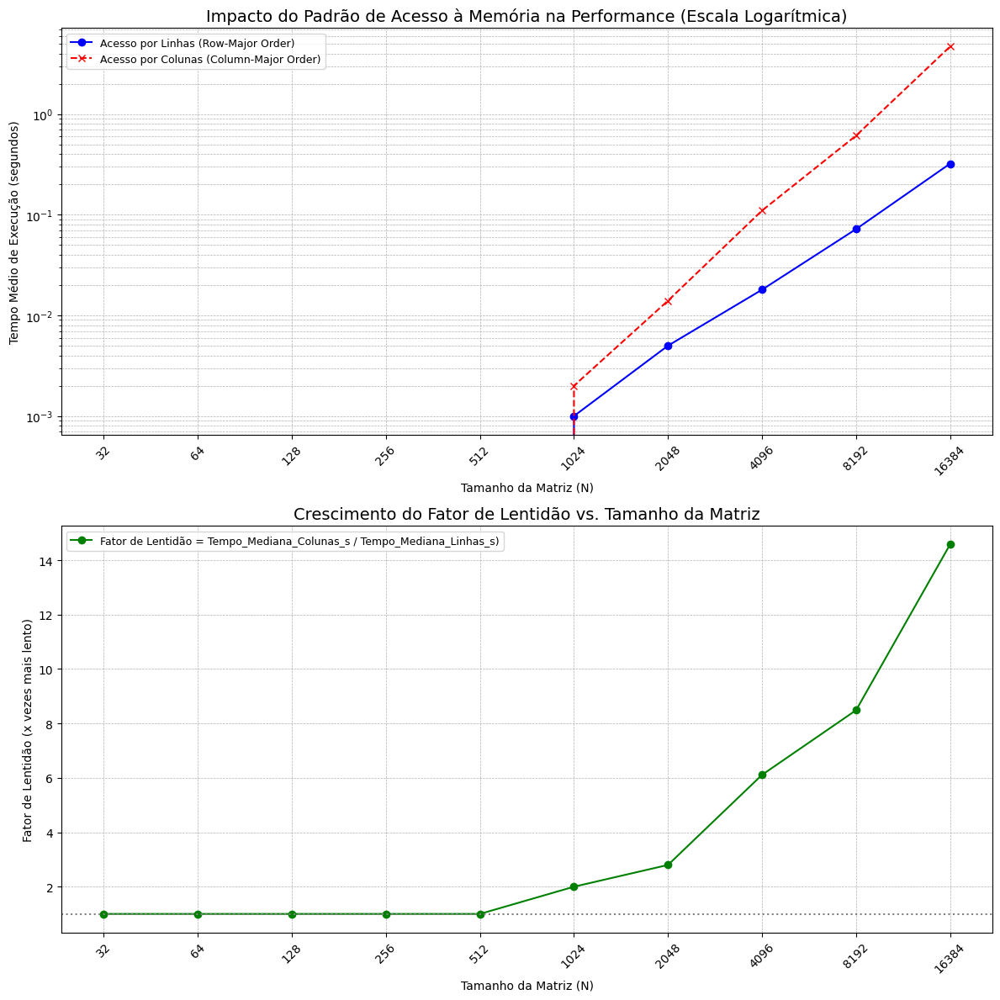

# Disciplina: Sistemas Distribuídos
**Professor:** samuel xavier de souza
**projeto SD 01**

## Descrição da tarefa
Implemente duas versões da multiplicação de matriz por vetor (MxV) em C: uma com acesso à matriz por linhas (linha externa, coluna interna) e outra por colunas (coluna Externa, linha interna). Meça o tempo de execução de cada versão com uma função apropriada e execute testes com diferentes tamanhos de matriz. Identifique a partir de que tamanho os tempos passam a divergir significamente e explique por que isso ocorre, relacionando suas observações com o uso da memória cache e o padrão de acesso à memória.

### Pergunta: A partir de que tamanho os tempos de execução passam a divergir significativamente e por quê?

## Objetivo do Teste
O presente estudo tem como objetivo demonstrar e quantificar o impacto da localidade de dados no desempenho de algoritmos computacionais. Especificamente, busca-se identificar o ponto a partir do qual o padrão de acesso à memória — sequencial versus não sequencial — causa uma divergência significativa no tempo de execução, correlacionando este fenômeno diretamente com a arquitetura da hierarquia de cache do processador.

## O Experimento: Acesso à Memória e a Hierarquia de Cache
Para isolar o efeito do padrão de acesso, foram implementadas duas versões funcionalmente idênticas de um algoritmo de multiplicação de matriz por vetor, que se diferenciam apenas na ordem de iteração dos laços de repetição:

### Com acesso por Linhas (Cache-Friendly)
`void multiply_matrix_vector( int rows, int cols, double **A, double *x, double *y )`

Nesta implementação, o laço interno percorre as colunas de uma determinada linha (`for j...`). Este padrão acessa elementos de memória contíguos (`A[i][0]`, `A[i][1]`, `A[i][2]`...), alinhando-se à forma como a linguagem C organiza matrizes na memória (layout *row-major*).

### Acesso por Colunas (Cache-Unfriendly)
`void multiply_matrix_vector_cols_outer( int rows, int cols, double **A, double *x, double *y )`

Nesta versão, o laço interno percorre as linhas de uma determinada coluna (`for i...`). Este padrão acessa elementos de memória distantes entre si (`A[0][j]`, `A[1][j]`, `A[2][j]`...), um modelo de acesso não sequencial.

A hipótese central é que o método de "Acesso por Linhas" obterá um desempenho superior devido ao princípio da localidade espacial. A memória cache da CPU não carrega dados da RAM byte a byte, mas sim em blocos contíguos chamados "linhas de cache" (geralmente 64 bytes). Quando o algoritmo solicita um elemento `A[i][0]`, a CPU antecipa a necessidade dos elementos vizinhos e carrega toda a linha de cache. O padrão de acesso sequencial se beneficia disso, encontrando os dados para as próximas iterações já no cache ultrarrápido (um *cache hit*).

Em contrapartida, o padrão de "Acesso por Colunas" invalida essa vantagem. O acesso a `A[1][j]` após `A[0][j]` requer um bloco de memória completamente diferente, forçando a CPU a descartar a linha de cache anterior e iniciar uma nova e dispendiosa busca na RAM (um *cache miss*). Este ciclo de substituições ineficientes no cache é a causa fundamental da degradação de performance.

## Procedimentos de Teste
Para a coleta de dados, o algoritmo foi executado com matrizes quadradas (N x N) de tamanho variável, com N variando de 32 a 16384. O ambiente de teste foi rigorosamente controlado:

* **Compilação:** O código-fonte foi compilado utilizando GCC com o nível de otimização `-O2` para simular um ambiente de produção e a flag `-fopenmp` para habilitar o cronômetro de alta precisão.
    ```bash
    gcc mxv_teste_grafico_v1.c -o mxv_teste_grafico_v1 -O2 -fopenmp
    ```
* **Medição de Tempo:** Para mitigar flutuações e garantir medições precisas, cada medição de tempo representa a **mediana** de múltiplas execuções. A mediana é estatisticamente mais robusta que a média por não ser afetada por ruídos do sistema. Para operações muito rápidas (matrizes pequenas), foram usadas técnicas de amplificação de tempo (laços de repetição internos) e prevenção de otimização do compilador para garantir que os tempos medidos fossem significativos e não nulos.
* **Coleta de Dados:** O programa foi projetado para gerar os resultados em formato CSV, incluindo o tamanho da matriz (N), os tempos de execução de ambos os métodos e o "Fator de Lentidão".
    ```bash
    ./mxv_teste_grafico_v1.exe > results.csv
    ```
* **Fator de lentidão:** É uma métrica que normaliza os resultados para entender o quão pior um método é em relação ao outro.
    * **Fórmula:** `Fator de Lentidão = Tempo_Mediana_Colunas_s / Tempo_Mediana_Linhas_s`

## Dados de Cache do Hardware de Teste
* **Tamanho do cache L1:** 2 x 48 KBytes = 96 KBytes
* **Tamanho do cache L2 unificado:** 2 x 1280 KBytes = 2560 KBytes
* **Tamanho do cache L3 unificado:** 6144 KBytes = 6144 KBytes

## Análise de Resultados: O Impacto da Hierarquia de Cache na Performance
A análise a seguir correlaciona os resultados esperados com a arquitetura de cache específica do hardware de teste.

**Nota sobre Artefatos de Medição:** Em implementações de benchmark mais simples, o tempo de execução para matrizes pequenas pode ser medido como zero, resultando em um Fator de Lentidão artificial de 1.0. A metodologia robusta adotada visa eliminar este artefato para revelar o comportamento real do hardware.

### Fase 1: Domínio do Cache On-Chip (N de 32 a ≈404)
Nesta faixa, o Fator de Lentidão deve ser baixo (próximo de 1.0), pois os dados de trabalho cabem inteiramente nos caches rápidos da CPU.
* **Sub-fase L1 (N até ≈78):** A matriz de trabalho cabe no cache L1. O desempenho é máximo e o padrão de acesso é quase irrelevante.
* **Sub-fase L2 (N de ≈79 a ≈404):** A matriz excede o cache L1, mas cabe confortavelmente no cache L2. Como o problema ainda reside em um cache rápido "on-chip", a penalidade por acessos não sequenciais é mínima.

### Fase 2: O Ponto de Inflexão e a Pressão sobre o Cache L3 (N de ≈405 a ≈886)
É neste ponto que a divergência de performance se torna sistemática e significativa.
* **Análise de Hardware:** Para `N=512` (matriz de 2 MB), os dados excedem a capacidade do cache L2 por núcleo (1.28 MB) e passam a depender do cache L3 de 6 MB, que é mais lento.
* **Resultado Esperado:** O Fator de Lentidão começa a crescer de forma consistente. O método de acesso por colunas se torna notavelmente mais lento, pois seu padrão de acesso ineficiente agora causa falhas no L2, forçando buscas no L3.

### Fase 3: O Colapso da Performance e a Dependência da RAM (N ≥ ≈887)
Nesta fase final, a importância de um algoritmo consciente do hardware torna-se drasticamente aparente.
* **Análise de Hardware:** Para `N=1024` (matriz de 8 MB), os dados excedem a capacidade total do cache L3 de 6 MB. Acessos constantes à lenta memória RAM são inevitáveis.
* **Resultado Esperado:** O Fator de Lentidão dispara, podendo atingir valores superiores a **15x** para matrizes maiores. Cada acesso no método por colunas tem alta probabilidade de causar um *cache miss* completo, forçando o processador a esperar por dados da RAM, enquanto o método por linhas, mesmo acessando a RAM, o faz de forma muito mais eficiente.

## Conclusão Geral
A divergência de performance entre os métodos se inicia de forma mensurável quando o tamanho dos dados excede a capacidade do cache L2, forçando o uso do cache L3. A diferença torna-se extrema quando os dados ultrapassam a capacidade do cache L3, tornando o acesso à memória RAM o principal gargalo. Isso prova que alinhar o padrão de acesso à memória do software com a organização física dos dados e a hierarquia de cache do hardware é um princípio fundamental para o desenvolvimento de aplicações de alto desempenho.

## Grafico Duplo


